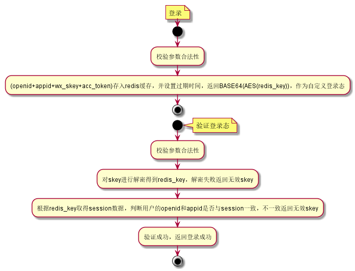

[TOC]

# 1. 背景与目标

1. 性能：在一台单核1G服务器上支持响应快(`5 ms`)，较大的并发量登录(以上单台服务器 200/s)，缓存登录信息达到10000-40000个用户
2. 安全：对用户的每次登录进行合法鉴权，且用户的登录是有有效期的；对前端不暴露微信 token，使用后台业务 token；小程序业务请求都必须带上 openid 和 token, server 验证 token 的合法性: token 对应的 openid 和传入的 openid 是否一致; token 是否过期，全部校验通过即可正常处理业务请求

# 2. 小程序验证登录态流程


## 前端登录流程图


## 小程序登录态接口

wx.login(OBJECT) 接口文档：

https://developers.weixin.qq.com/miniprogram/dev/api/api-login.html#wxchecksessionobject

微信接口服务(登录凭证校验) 接口文档：

https://developers.weixin.qq.com/miniprogram/dev/api/api-login.html#%E7%99%BB%E5%BD%95%E5%87%AD%E8%AF%81%E6%A0%A1%E9%AA%8C


# 3. 后台登录


## 用户登录 session

### session 内容

```json
{
	"openid": "",
	"appid": "",
	"wx_skey": "",
	"access_token": "",
	"create_time": ""
}
```

### 存储 Mysql vs Redis

为了保证在一台单核1G服务器上支持响应快(`5-10 ms`)，较大的并发量登录(以上单台服务器 100/s)，缓存登录信息达到10000-40000个用户；

在设计前，先对本次服务部署的服务器分别对 Mysql 和 Redis 的性能进行一次性能压测；

#### Mysql 性能压测

用于压测的数据库例子，Fid 为主键：

```
mysql> desc db_ccm_cx.t_bus_no;
+------------------+-------------+------+-----+---------+----------------+
| Field            | Type        | Null | Key | Default | Extra          |
+------------------+-------------+------+-----+---------+----------------+
| Fid              | bigint(20)  | NO   | PRI | NULL    | auto_increment |
| Fbus_no          | varchar(64) | NO   |     | NULL    |                |
| Foriginal_bus_no | varchar(64) | NO   | MUL | NULL    |                |
| Frelate_type     | int(11)     | NO   |     | NULL    |                |
| Fsign            | varchar(32) | NO   |     |         |                |
| Fcreate_time     | datetime    | NO   |     | NULL    |                |
| Fmodify_time     | datetime    | NO   |     | NULL    |                |
+------------------+-------------+------+-----+---------+----------------+
```

用于压测的查询语句：`select * from t_bus_no where Fid=1000;`

模拟 100 个客户端，每个客户端执行查询语句 1 次：

```
[root@VM_29_163_centos ~/temp/redis-stable]# mysqlslap --concurrency=100 --iterations=10 --create-schema='db_ccm_cx' --query='select * from t_bus_no where Fid=1000' --number-of-queries=100 --debug-info
```

按照上面的方法，分析得出 mysql 性能压测数据：

| 表数据量/万 | 客户端数量 | 查询总次数 | 耗时/ms | 支持并发量 次/s |
| ----------- | ---------- | ---------- | ------- | --------------- |
| 1           | 100        | 100        | 23      | 4347            |
| 1           | 100        | 200        | 27      | 7407            |
| 1           | 200        | 200        | 49      | 4081            |
| 1           | 300        | 300        | 74      | 4054            |
| 1           | 100        | 300        | 44      | 6818            |
| 5           | 100        | 100        | 23      | 4347            |
| 5           | 100        | 200        | 35      | 5714            |
| 5           | 200        | 200        | 51      | 3921            |
| 5           | 300        | 300        | 72      | 4166            |
| 5           | 100        | 300        | 38      | 7894            |

####  Redis 性能压测

压测 REDIS 指令 GET 和 SET，大小为 256 字节：

```
redis-benchmark -c 50 -n 10000 -d 256 -t get,set
```

| 客户端数量 | 请求次数 | SET 支持并发量 次/s | GET 支持并发量 次/s |
| ---------- | -------- | ------------------- | ------------------- |
| 100        | 100      | 33333.33            | 16666.67            |
| 100        | 10000    | 88495.58            | 88495.58            |
| 10000      | 10000    | 19083.97            | 27932.96            |

#### 性能总结

在性能上，Redis 完全碾压 Mysql，Redis 一次请求，在多种情况下，平均最大的一次为 0.06 ms，Mysql 则为0.23ms，最接近相差 4 倍；

Redis 还有其他优势，它是存储于内存，且每个 key 可以设置自动过期时间，对登录态失效管理比较方便。

在这个业务下，用 Mysql 或 Redis 影响不大，这里选用 Redis。

## 后台登录流程图



## 后台登录态接口设计

### login

* 接口描述：登录服务
* 输入参数


| 名称  | 数据类型 | 说明 | 字段标识 |
| ----- | -------- | ---- | -------- |
| openid | string(64) | 用户openid | M |
| appid | string(64) | 小程序appid | M |
|  code     | string(64)         | 微信授权code         |  M    |
| | | |


* 输出参数

| 名称  | 数据类型 | 说明 | 字段标识 |
| ----- | -------- | ---- | -------- |
| skey | string(64) | session key | M |
|  open_id     |  string(64) | 用户openid | M |
|       |          |          |      |

### auth

* 接口描述：验证登录
* 输入参数
| 名称  | 数据类型 | 说明 | 字段标识 |
| ----- | -------- | ---- | -------- |
| openid | string(64) | 用户openid | M |
| appid | string(64) | 小程序appid | M |
|  skey     | string(64)         | session key         |  M    |
| | | |

* 输出参数

| 名称  | 数据类型 | 说明 | 字段标识 |
| ----- | -------- | ---- | -------- |
| if_login | int | 是否登录，1 已登录，2未登录 | M |
|       |          |          |      |

